# Project 2:  Analysis and Backtesting of Trading Indicators to Identify Optimal Trading Models

## Project Goal: 

This project will focus on creating, backtesting, and analyzing Quantitative Algorithmic Trading model performance on a sample of optionable stocks.  The goal is to answer the following business questions:

 * Which technical indicators are the best indicators to use in building quantitative algo trading models?
 * Do Algo trading models utilizing the optimized indicator model for each specific stock beat a buy and hold strategy?
 * Do we see varied indicator performance by stock being traded such that some indicators perform better on certain stocks?


### **1. Data Collection:** ###

* Obtain historical data for the desired timeframe.
* Yahoo Finance data will be our primary data sources.
* Project 1 Optionable Stock Universe will be our sample of stocks on which to test and build indicator based trading models.
* Technical indicators under consideration in algo model building include:
  - Squeeze Indicator (Bollinger Bands + Keltner  Channels)
  - 20 EMA
  - 50 EMA
  - MACD Two-Line
  - ADX Indicator
  - MFI
  - Chaikin Oscillator
  - Bollinger Bands
  - Ichimoku Cloud (time permitting)

 * Trading Timeframes for data collection and analysis include:
 * We will be focused on daily timeframe position trades across our ~90 optionable stock universe sample
 * Gather relevant features such as opening price, closing price, highest price, lowest price, and volume for each time intervals. 
 * Time Period used for analysis:
   - 2017 – 2022

### **2. Data Preprocessing:** ###
  * Perform data cleaning by handling missing values,  outliers, and inconsistencies.
  * Explore the dataset to identify any potential  patterns or correlations between features.
  * Build a looping function that iterates through all possible indicator combinations in signal modeling.
  * Rank order best models by stock being analyzed using Sharpe Ratio and Cumulative Returns.
  * Develop Segmentation schemes using Sharpe Ratios to see if we can improve trading model performance.

### **3. Data Analysis and Conclusions:** ###


 **Which technical indicators we're testing are the best indicators to use in building quantitative algo trading models?**

* When analyzing the best indicators for algo models we split the testing into buy signal indicators and sell signal indicators so we're not always using the same indicator for buying and selling.  

#### **Best Buy Indicators for Algo Models** #### 

Rank Ordering of the best ``Buy`` Indicators that showed up the most in our algo models based on ``cumulative returns``:

1.  The Squeeze Signal 
2.  EMA 50
3.  MACD Signal
4.  EMA 20
5.  Chaikin Oscillator Signal
6.  MFI Signal

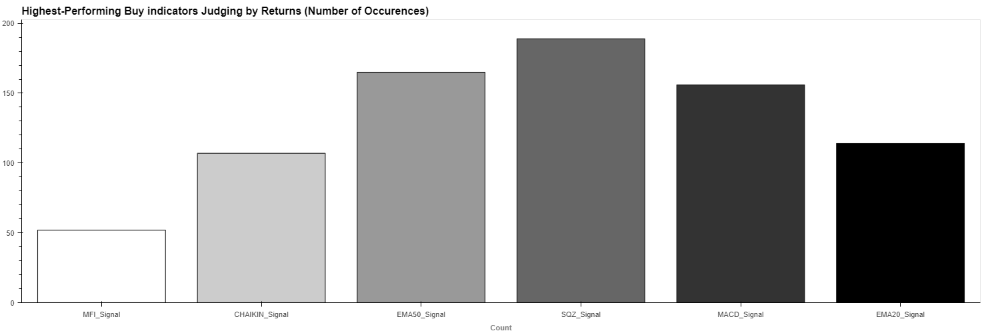

Rank Ordering of the best ``Buy`` Indicators that showed up the most in our algo models based on ``sharpe ratios``:

1.  The Squeeze Signal 
2.  MACD Signal
3.  EMA 50
4.  EMA 20
5.  Chaikin Oscillator Signal
6.  MFI Signal

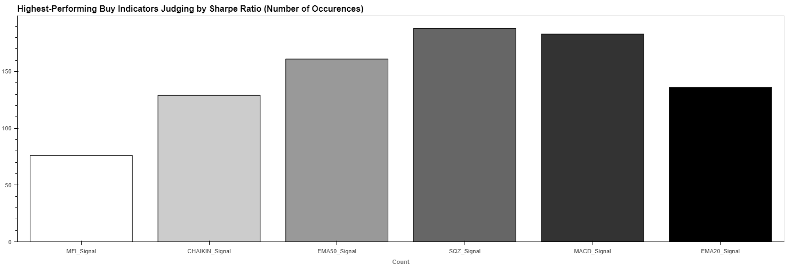

#### **Best Sell Indicators for Algo Models** #### 

Rank Ordering of the best ``Sell`` Indicators that showed up the most in our algo models based on ``cumulative returns``:

1.  Bollinger Band Signal 
2.  MACD Signal
3.  EMA 20 Signal

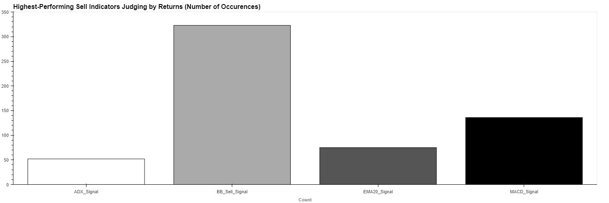

Rank Ordering of the best ``Sell`` Indicators that showed up the most in our algo models based on ``sharpe ratios``:

1.  Bollinger Band Signal  
2.  MACD Signal
3.  EMA 20 Signal

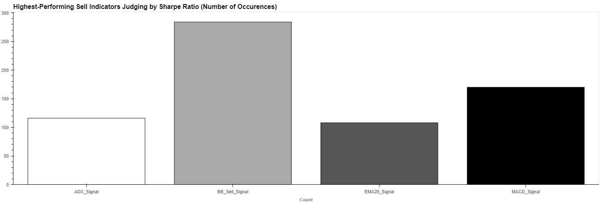

Rank ordering by returns or Sharpe ratio does not show much difference in performance.  We do see select indicators showing up more consistently in buy and sell indicators.  We also see stocks have a differing mix of indicators that produces the most efficient algo model.  There is no one true model that wins across the board for all stocks.

 **Do Algo trading models utilizing the optimized indicator model for each specific stock beat a buy and hold strategy?** 

 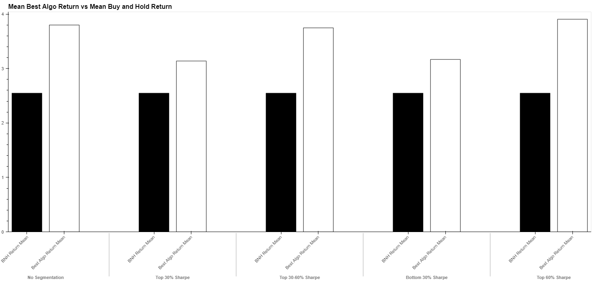

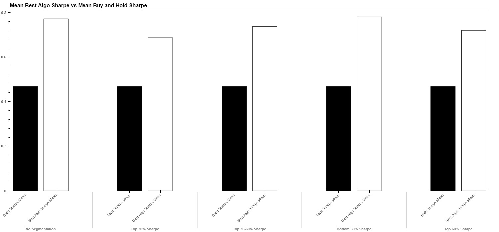

These two charts clearly show algo models can beat buy and hold strategies in terms of cumulative returns and sharpe ratio performance over the time period analyzed (2017-2023).  This holds true with or without segmentation, drilling down deeper to understand these trends we find additional insights.

#### **No Segmentation: Algo Models v Buy and Hold (BNH) - Sharpe Ratio/Cum. Returns Ranking by Stock:** ####

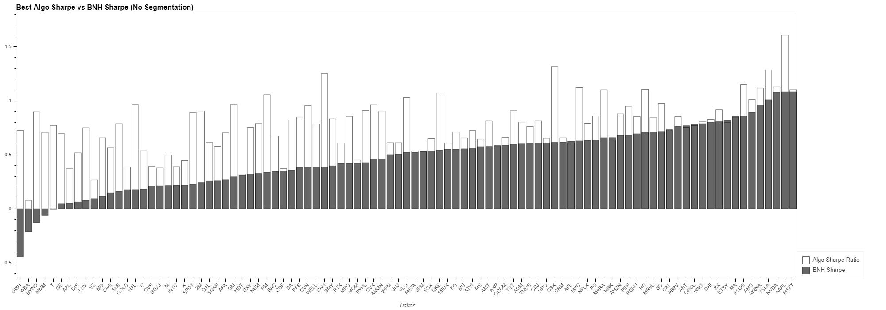

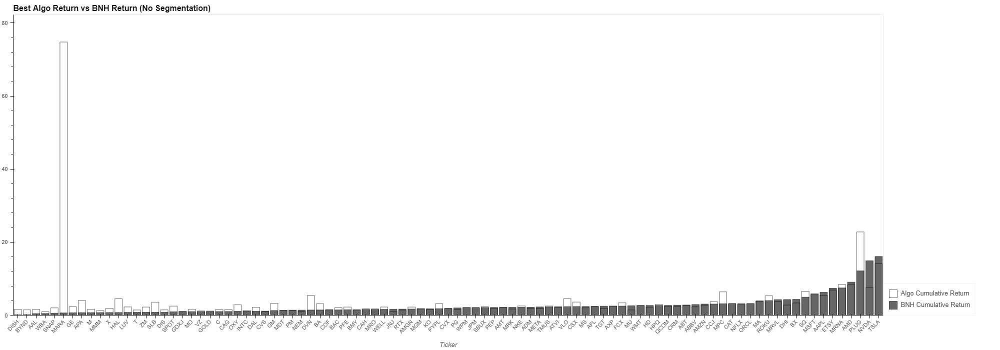

We see the best algo models increase the sharpe ratio efficiencies for 62 / 95 stocks or ~67% of stocks in the sample.  The cumulative returns however seem similar to worse off across all stocks with one stock (MARA) driving most of the higher returns within the algo modeling group.  

This tells us in a no segmentation scenario, algo models generally increase returns per unit of risk overall but one stock is skewing the cumulative returns performance vs BNH.

#### **With Segmentation: Algo Models v Buy and Hold (BNH) - Sharpe Ratio/Cum. Returns Ranking by Stock: Top 30%** ####

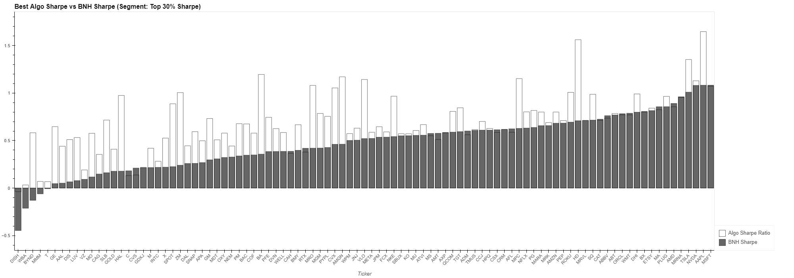

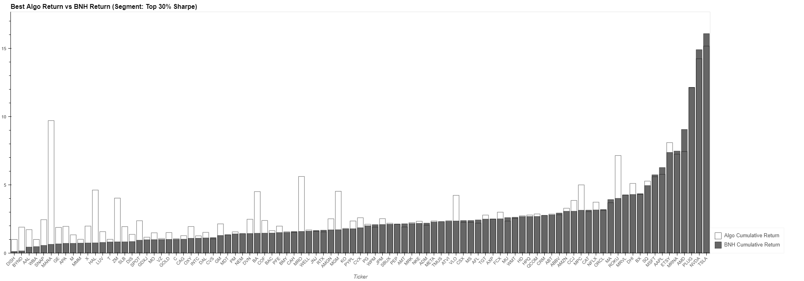

When we begin segmenting the population by sharpe ratio, we see a little more separation in model performance vs. BNH in both sharpe ratio performance and cum. return performance vs No segmentation.

We also start seeing a trend where algo models increase performance separation vs. BNH where BNH returns are poor relative to the market.  Algo models don't increase return and ratio performance as effectively on stocks alreaedy performing well on these metrics.

#### **With Segmentation: Algo Models v Buy and Hold (BNH) - Sharpe Ratio/Cum. Returns Ranking by Stock: Top 30-60%** ####

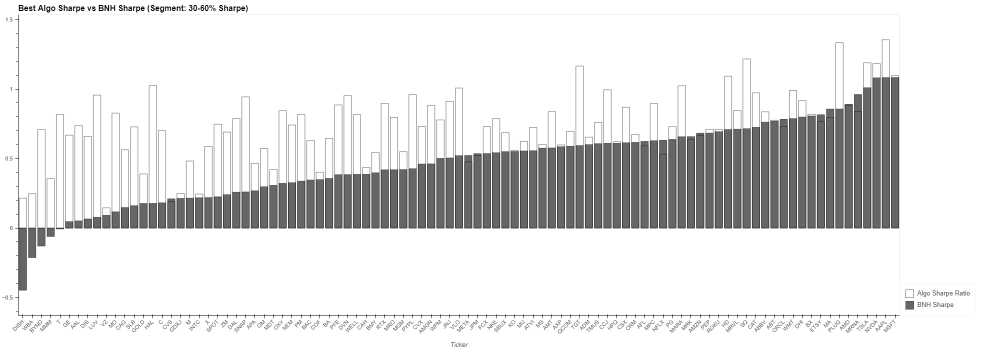

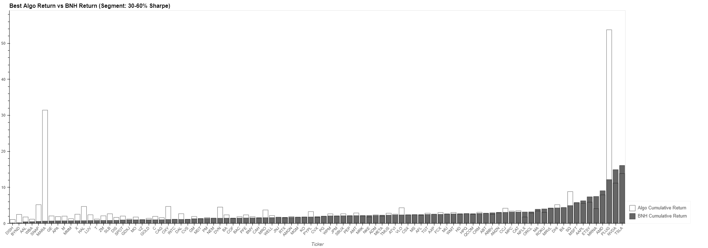

The next tier of sharpe ratios show similar trends continue with higher sharpe ratios across most stocks with returns again very similar but with two major outliers driving overall performance of algo model returns vs. BNH.

#### **With Segmentation: Algo Models v Buy and Hold (BNH) - Sharpe Ratio/Cum. Returns Ranking by Stock: Bottom 30%** ####

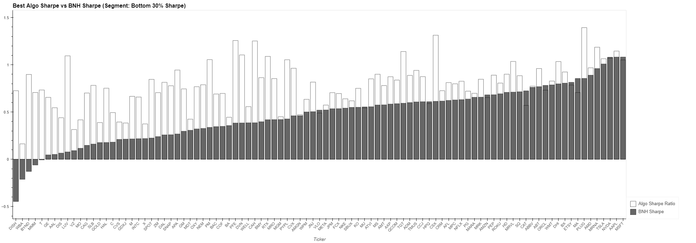

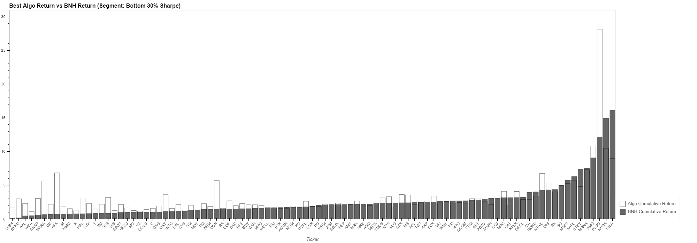

Again, we see similar patterns in the bottom 30% of stocks ranked by sharpe ratio; however, we also see more impact of algo models on both sharpe ratio impact and cumulative stock returns.  This is showing us algo models may have more impact on lower performing stock returns vs. higher performing stock returns.

 **Do we see varied indicator performance by stock being traded such that some indicators perform better on certain stocks?**

 Our analysis does show the best indicator model to maximizing sharpe ratio and cumulative returns for each stock varies and is not consistently one single indicator model.  This tells us we should customize algo trading models for each stock to maximize investment performance.

 Sample output below shows model performance metrics for one stock.  Analyzing this for ~59-68 winning algo models gives us a broad portfolio view of performance (too lengthy a print out to go over all 65+ algo model performance summaries).

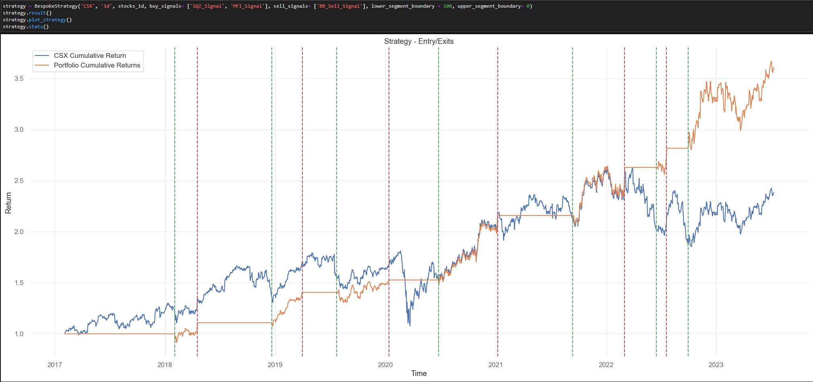

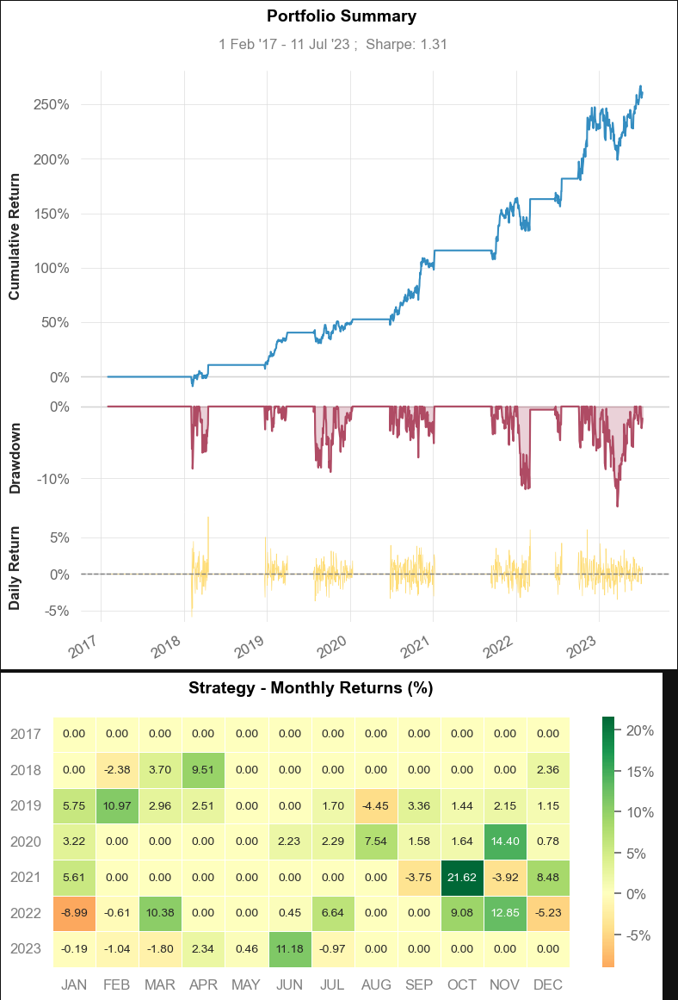

--------------
## Notebooks
- [JUPYTER LAB NOTEBOOK LINK](./main.ipynb)
- [Final Analysis](./README.md)
---------

## Getting Started - Prerequisites
-----------
### ​You must have Python 3 installed:

```
python3 --version
```

### You must have Anaconda installed:
```
$ anaconda --version
```

### Install Environmnet:
```
conda create -n <env_name> python=3.7 anaconda
```

### Clone/Run Repository 
```
git clone git@github.com:OddMerchantStudios/Project-2-Algo.git
```

### Activate Environment
```
conda activate <env_name>
```

### Install Dependencies
- Please make sure you are in your intended activate environment before running this command
```
pip install -r requirements.txt
```


## Built With

- []([https://www.python.org/downloads/release/python-3713/)
[](https://www.python.org/downloads/release/python-3713/) - Programming Language
- [](https://pandas.pydata.org/docs/#) - Data maniupulation library
- [](https://numpy.org/) - Multi-dimensional array library
- [](https://plotly.com/python/) - Visualization library for plots
- [](https://hvplot.holoviz.org/) - Visualization library for plots
- [](https://jupyter.org/) - Notebook IDE
- [](https://jupyter.org/) - Notebook IDE
- [](https://www.anaconda.com/) - Data science platform
- [](https://pypi.org/project/yfinance/) - Yahoo Finance API
- [](https://scikit-learn.org/stable/) - Machine learning library
- [](https://pypi.org/project/quantstats/) - Quantstats library
- [](https://pypi.org/project/pyportfolioopt/) - PyPortfolioOpt library
- [](https://pypi.org/project/cufflinks/) - Cufflinks library

## Authors
- **Kirill Chugunov** - [LinkedIn](https://www.linkedin.com/in/kirill-chugunov-b680811a4/) | [Github](https://github.com/OddMerchantStudios)
- **Hiren Patel** - [LinkedIn](https://www.linkedin.com/in/hdpatel/) | [Github](https://github.com/hpnhs25)
- **Varoujan John Khorozian** - [LinkedIn](https://www.linkedin.com/in/varoujan-khorozian/) | [Github](https://github.com/vkhorozian)
